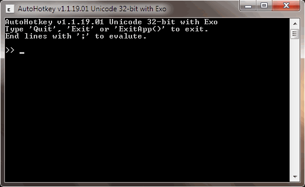

Exo-CLI
===========================

Command line interface for AHK-Exo Lang  
Released under the [MIT License](http://opensource.org/licenses/MIT)  
  
**Requires** [Exo] https://github.com/Aurelain/Exo  
  
###Screenshot

  
###How to Compile
Copy `Compile_Exo-CLI.ahk`, `Resources/` and `Exo-CLI.js` in to a folder with all the `Exo` files. Then, Simply run `Compile_Exo-CLI.ahk` and it will create `Exo-CLI.exe`.  
_NB_ : AutoHotkey needs to be **Installed**.